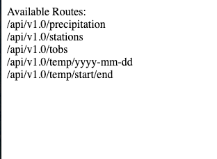
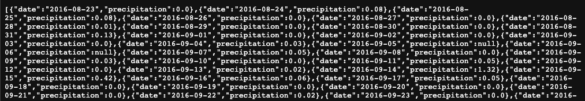
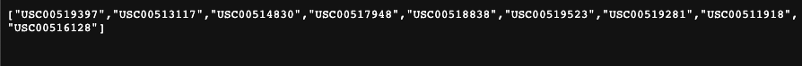
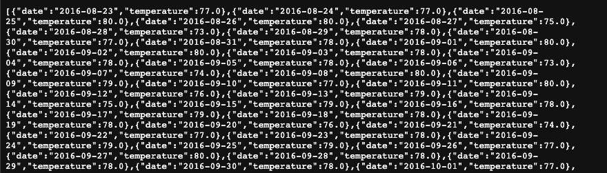
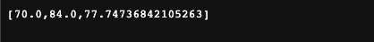

# sqlalchemy-challenge
Module 10 challenge

### Background
You've decided to treat yourself to a long holiday vacation in Honolulu, Hawaii. To help with your trip planning, you decide to do a climate analysis about the area. The following sections outline the steps that you need to take to accomplish this task.

### Part 1: Data Analysis
Basic climate analysis and data exploration of the "hawaii.sqlite" database using SQLAlchemy, Pandas, and Matplotlib.
See "climate_analysis.ipynb" file for commented code.
[climate_analysis.ipynb](SurfsUp/climate_analysis.ipynb)

#### Findings

* Precipitation data from 8/23/2016 to 8/23/2017

* Temperature Observations for station USC00519281 from 8/23/2016 to 8/23/2017

## Part 2: Climate App
Design Flask API based on the data analysis queries.
See "app.py" file for commented code:
[app.py](SurfsUp/app.py)

* Homepage

* JSON representation of precipitation analysis dictionary

* JSON list of stations from dataset

* JSON list of temperature observations for the most-active station (USC00519281) from 8/23/2016 to 8/23/2017

* JSON list of the minimum temperature, the average temperature, and the maximum temperature for a specified start or start-end range.
Example dates:

